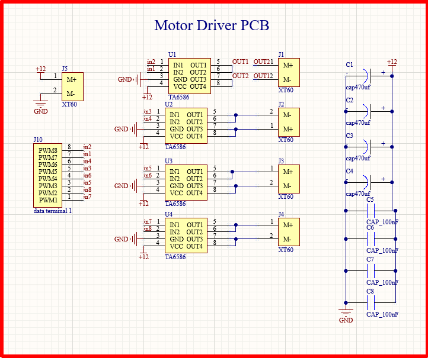
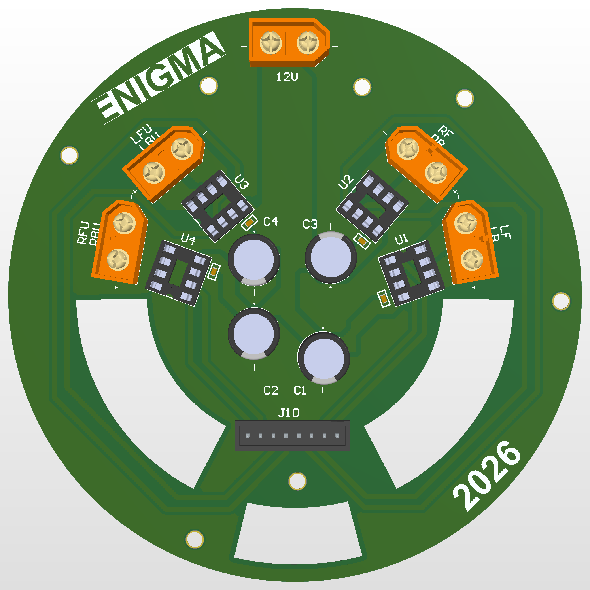

# PCB-Design-Portfolio
Professional PCB designs using Altium Designer
## 🚀 Customized Motor Driver PCB

This PCB is designed to control motors efficiently with stable power delivery and reliable signal routing.

### 🔧 Features
- Motor driver integration
- Optimized power routing
- Compact design

### 🖼️ Images

#### 🔹 Schematic

#### 🔹 PCB Top

#### 🔹 PCB Bottom

